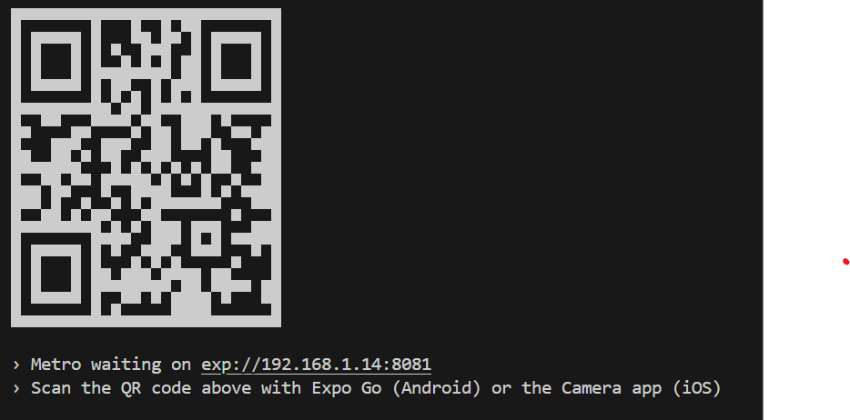

# PetApp: Full Stack Mobile Application Documentation

PetApp is a fully functional mobile application developed with React Native for the frontend and Firebase for the backend. The app provides a wide range of features that help users manage pet information, store images, track user events, and chat with others for pet adoption.

## Features

### 1. User Management
- Users can log in with Google.
- Add pet information including name, breed, age, weight, and health status.
- Upload and store pet images in Firebase Storage.
- View saved pet information and chat with other users.

### 2. Pet Management
- Manage a list of pets including details such as name, breed, weight, and health status.
- Upload and store pet images in Firebase Storage.
- Edit and delete pet information.

## Technology Stack

### Frontend Libraries
- React Native
- Expo
- Firebase SDK
- Expo Image Picker
- @clerk/clerk-expo
- Moment
- expo-web-browser ,expo-constants

### Backend Libraries
- Firebase Firestore
- Firebase Storage
- Firebase Analytics

## Setup Instructions

### 1. Environment Setup

Ensure you have the following tools installed:
- [Node.js](https://nodejs.org/en/)
- [Expo CLI](https://docs.expo.dev/get-started/installation/)
- [Firebase Project](https://firebase.google.com/)

### 2. Installing the Application
- cd app
- npm start

